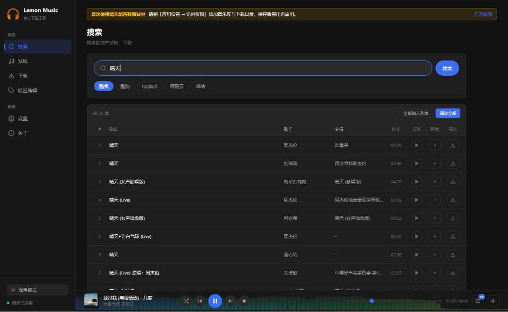
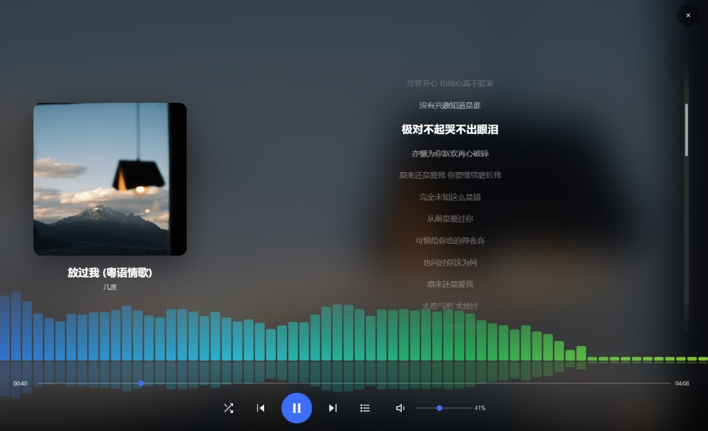
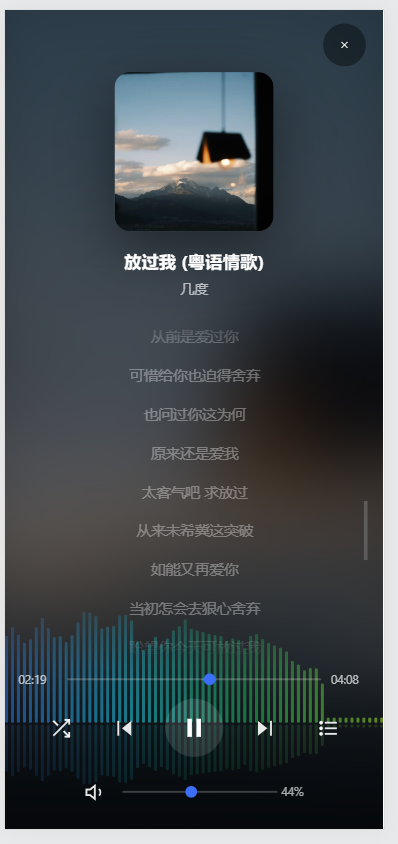
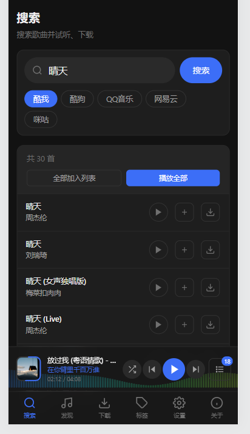

# 柠檬音乐下载 · Lemon Music

面向飞牛 NAS 与自托管环境的 **Web 音乐工具**：多平台搜索、歌单发现、在线试听、批量下载、本地标签管理。兼容落雪音乐（LX Music）自定义音源脚本，在浏览器中即可完成「找歌 → 试听 → 下载 → 整理」全流程。

当前版本：**v1.0.11**  
仓库：[https://github.com/jia070310/lemon-muisc](https://github.com/jia070310/lemon-muisc)

---

## 界面预览

### 搜索 · 试听 · 下载（桌面端）

多平台关键词检索，结果列表支持单曲试听、加入试听队列、按音质下载；底栏播放器常驻，频谱动效实时跳动。



### 全屏播放 · 频谱可视化 · 滚动歌词（桌面端）

点击封面进入全屏模式，蓝绿渐变频谱铺满底部，歌词实时滚动高亮，支持进度、音量、播放控制。



### 移动端自适应

手机访问自动切换紧凑布局：全屏播放横竖屏均可用，歌词清晰大字显示。

| 全屏播放 | 搜索页 |
|----------|--------|
|  |  |

> 请仅用于个人已合法授权的音乐资源管理。请遵守当地法律法规及各平台服务条款，不要将本项目用于侵权或商业用途。

---

## 功能概览

### 搜索

- 支持 **酷我、酷狗、QQ 音乐、网易云、咪咕** 等平台（通过激活的音源脚本检索）
- 按关键词分页搜索，展示歌名、歌手、专辑、时长与可用音质
- 单曲 **试听**、**加入试听列表**、**选择音质下载**
- 批量「播放全部」「全部加入列表」

### 发现（歌单）

- 粘贴歌单链接或 ID，解析并展示歌单信息与完整歌曲列表
- **推荐歌单**：按平台切换，支持「最热 / 最新」排序
- 歌单内歌曲支持试听、加入队列、按音质下载
- 网易云等大型歌单通过批量接口补全，避免只显示部分歌曲

### 试听与播放

- 底栏 **播放器**：播放 / 暂停、上一首 / 下一首、进度条、音量精确调节
- **音频可视化**：播放栏背景蓝绿渐变频谱动效，随音频实时跳动
- **全屏播放页**：点击封面打开；大封面、实时滚动歌词、底部沉浸式频谱、进度与音量控制
- **试听列表**：持久化到本地，支持列表循环、单曲循环、随机播放
- 封面样式：圆形唱片（旋转）或圆角卡片
- 音量控制：垂直滑杆精确调节、一键静音 / 恢复、音量持久化；移动端自动隐藏（用物理音量键）
- 播放器响应式布局：宽屏完整控制；窄屏 / 移动端自动切换紧凑模式（循环、队列等按钮保留）
- 深色 / 浅色主题切换

### 下载

- 下载任务队列：等待、下载中、暂停、完成、失败等状态，WebSocket 实时进度
- **下载设置**：
  - 保存路径（从已配置的音乐目录中选择）
  - 文件名格式：歌名 - 歌手 / 歌手 - 歌名 / 仅歌名
  - 最大并发数（1～6）
  - 跳过已存在文件
  - **按专辑名分组**（在保存目录下按专辑创建子文件夹）
- **内嵌数据**（MP3 / FLAC）：封面、歌词、翻译歌词、罗马音歌词
- **歌词文件**：同名 `.lrc`，可选翻译 / 罗马音，编码 UTF-8 或 GBK
- 歌词获取：内置 SDK → 音源脚本 → 按歌名搜索；支持跨平台补歌词

### 标签编辑

- 扫描本地音乐目录，表格浏览文件名、标题、歌手、专辑、封面与歌词状态
- 单文件 / 批量编辑 ID3 与 FLAC 标签（标题、歌手、专辑、封面、歌词等）
- **按文件名自动匹配** 网络元数据（可选平台），批量写入封面与歌词
- 本地文件 **试听**、加入试听列表（按钮位于每行末尾）
- 支持飞牛环境通过系统文件管理器选择目录

### 设置

| 模块 | 内容 |
|------|------|
| **文件路径** | 音乐库目录、下载默认路径；Docker / FPK 挂载状态探测 |
| **音源管理** | 本地 `.js` 或 URL 导入、激活 / 停用 / 删除；故障音源隔离与提示 |
| **试听设置** | 界面主题、播放栏封面样式、**音频可视化开关** |
| **下载设置** | 路径、文件名、并发、跳过已存在、按专辑分组 |
| **内嵌数据** | 封面 / 歌词 / 翻译 / 罗马音写入音频文件 |
| **歌词文件** | 独立 `.lrc`、翻译 / 罗马音、编码 |

### 关于与更新

- 关于页展示当前版本，并检测 GitHub Release 是否有新版本
- 侧栏可提示有新版本可用

### 飞牛 NAS 特性

- **FPK 应用包** + **Docker 镜像** 双渠道部署，Web UI 端口默认 **7983**
- Docker 镜像支持 **x86_64 / ARM64** 多架构；飞牛 x86、飞牛 ARM 设备使用同一个镜像 tag 即可自动匹配
- 安装向导支持镜像拉取进度、国内加速地址（如 `ghcr.1ms.run`）；含**注意事项**步骤
- **卸载向导**：可选「保留数据」或「删除数据」，不会删除用户自己的音乐文件
- 可通过飞牛 **文件选择器** 添加 NAS 路径（自动映射为容器内路径）
- 配置、下载任务、试听队列等数据持久化在挂载目录

---

## 技术栈

| 部分 | 说明 |
|------|------|
| 前端 | Vue 3 + Vue Router + Vite |
| 后端 | Node.js 20+、Express 5、WebSocket |
| 数据 | better-sqlite3（配置、下载任务、音源信息） |
| 标签 | node-id3、music-metadata |
| 可视化 | Web Audio API + Canvas（频谱分析） |
| 部署 | Docker 镜像（`ghcr.io/jia070310/lemon-muisc`）、飞牛 FPK |

---

## 快速开始（本地开发）

需要 [Node.js](https://nodejs.org/) 20 或以上。

```bash
git clone https://github.com/jia070310/lemon-muisc.git
cd lemon-muisc
npm install
npm run dev
```

| 地址 | 作用 |
|------|------|
| http://localhost:5174 | Vite 开发前端（热更新） |
| http://localhost:7983 | Express 后端（API、WebSocket、下载与标签） |

开发时用 **5174** 打开页面；`/api` 和 `/ws` 会代理到 7983。

生产模式：

```bash
npm run build
npm start
```

访问 http://localhost:7983（静态资源来自 `dist/public`，改源码后需重新 `build`）。

### 首次使用

1. **设置 → 音源管理**：导入落雪兼容音源脚本并激活
2. **设置 → 文件路径**：添加音乐 / 下载目录
3. **搜索** 或 **发现** 找歌试听、下载；**标签编辑** 整理本地文件

---

## Docker Compose 部署

复制下面内容保存为 `docker-compose.yml`，把 `volumes` 改成你的目录。完整说明见 [docs/docker-compose.md](docs/docker-compose.md)。

```yaml
version: "3"
services:
  lemon-music:
    image: ghcr.io/jia070310/lemon-muisc:latest
    ports:
      - "7983:7983"
    restart: unless-stopped
    environment:
      PORT: 7983
      DOWNLOAD_PATH: /music
      CONFIG_PATH: /config
    volumes:
      - "/Music/data:/music"
      - "/Music/downloads:/downloads"
      - "/Music/config:/config"
```

```bash
docker compose up -d
```

国内网络可将镜像改为 `ghcr.1ms.run/jia070310/lemon-muisc:latest`，详见 [docs/docker-compose.md](docs/docker-compose.md)。

> FPK 安装包体积小，**不内置镜像**；安装时由飞牛 Docker 拉取。国内说明见 [docs/fpk-install.md](docs/fpk-install.md)。
> 同一镜像 tag 同时支持 **x86_64 / ARM64**，Docker 会按设备架构自动选择。

---

## 飞牛 NAS（FPK）

应用 ID：`lemon-music`，显示名：**柠檬音乐下载**。

```powershell
npm run fpk:build
```

生成 `fpk/lemon-music.fpk`，在飞牛 **应用中心 → 手动安装**（不要点卡片「更新」）。

安装说明、注意事项、镜像加速与**卸载时保留/删除数据**见 [docs/fpk-install.md](docs/fpk-install.md)。

---

## 常用脚本

| 命令 | 说明 |
|------|------|
| `npm run dev` | 同时启动前后端开发服务 |
| `npm run build` | 构建前端到 `dist/public` |
| `npm start` | 启动后端（API + 静态页面） |
| `npm run docker:build` | 本地构建 Docker 镜像 |
| `npm run fpk:build` | 打包 FPK |

---

## 目录结构

```
├── docs/                # 部署文档、截图、Release 说明
├── src/                 # Vue 前端
├── server/              # Express 后端、音源运行时、平台 SDK
├── fpk/                 # 飞牛应用打包
├── scripts/             # 构建脚本
├── Dockerfile
└── docker-compose.yml
```

---

## 版本与更新

- 当前版本见仓库 [Releases](https://github.com/jia070310/lemon-muisc/releases)
- 各版本变更说明：[docs/RELEASE-NOTES.md](docs/RELEASE-NOTES.md)
- 应用内 **关于** 页会检测 GitHub 最新 Release

---

## 致谢与声明

音源脚本需自行准备，本仓库不内置任何第三方平台音源。项目定位为 NAS 上的个人音乐整理工具，与落雪音乐桌面版无官方从属关系。

## License

个人使用。若需二次分发，请自行补充许可证并保留本声明。
