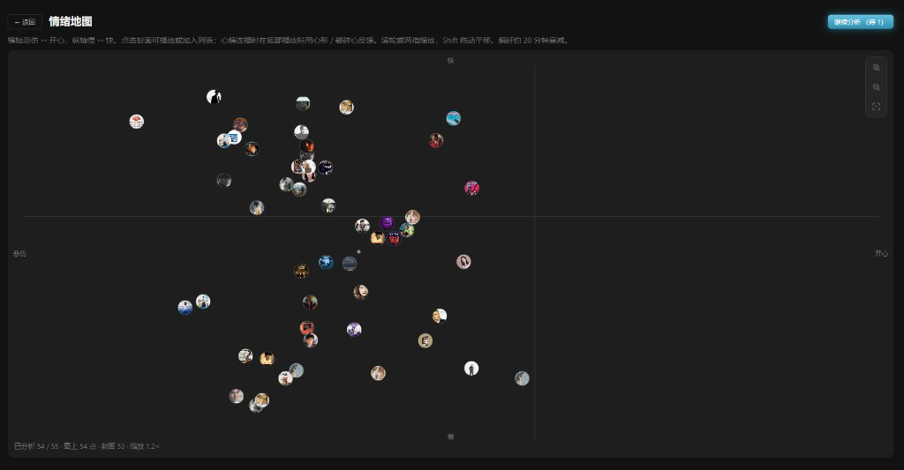
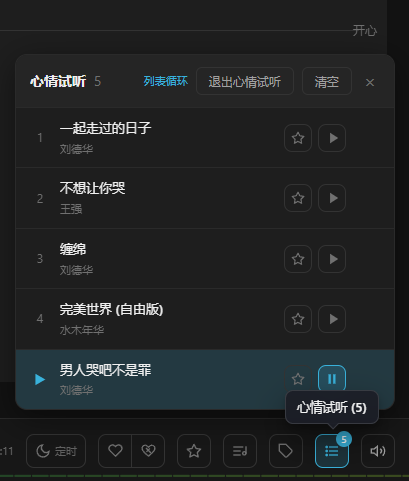
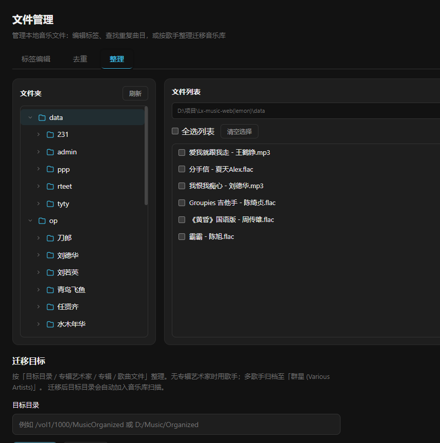

# 柠檬音乐下载 · Lemon Music

[](LICENSE)
[](https://github.com/jia070310/lemon-muisc/releases)

面向飞牛 NAS 与自托管环境的 **Web 音乐工具**：多平台搜索、歌单发现、在线试听、批量下载、本地标签管理。兼容落雪音乐（LX Music）自定义音源脚本，在浏览器中即可完成「找歌 → 试听 → 下载 → 整理」全流程。基于落雪音乐修改

当前版本：**v1.2.16.12** · 开源协议：**[MIT](LICENSE)**  
飞牛应用中心显示名：**柠檬音乐**（浏览器标题仍为「柠檬音乐下载」）  
仓库：[https://github.com/jia070310/lemon-muisc](https://github.com/jia070310/lemon-muisc)

飞牛 FPK 为**独立原生应用**，运行时使用应用中心 **Node.js v22**。

-QQ 互动群「飞牛柠檬🍋muisc」（群号 1126326017）
- 


### v1.2.16.12

- **情绪地图启发式 v5**：多段中位数、调式弱先验、本库相对分布标定；新文件自动后台补分析
- **AI（Essentia）一键准备**：自动安装依赖与 MusiCNN / emoMusic 模型；配置目录持久化，保留数据升级可复用
- 情绪引擎下拉统一为 AppSelect；AI 未就绪时回退本地启发式

### v1.2.16.11

- **关于页更新**：管理员可将 FPK 经加速/直连保存到 NAS「下载目录/柠檬音乐更新」，带进度与成功/失败提示；同名文件自动 `-1/-2` 递增不覆盖
- **批量下载**：歌单内批量下载也可勾选「保存到歌单文件夹」（与整单循序下载一致）
- **专辑检测**：音乐库专辑详情可对比在线专辑，补全缺曲，并升级本地较低音质（覆盖原文件）

### v1.2.16.10

- **路径权限**（音乐库 + 下载）：管理员可为用户指定「管理员路径 / 专属路径 / 允许自选」；专属模式下音乐库、情绪地图、文件管理仅见本账号目录
- **歌单循序下载**：支持分批下载与间隔，可选按歌单建文件夹
- **车机流畅播放增强**：AAC 改为约 128kbps、预热下一首、开流畅时自动关可视化；降低锁屏/CarPlay Now Playing 进度推送频率，减轻跨进程刷新卡顿

### v1.2.16.9

- 修复升级后缺 `nodemailer` 导致无法启用（[#34](https://github.com/jia070310/lemon-muisc/issues/34)）：补装依赖 + 邮件按需加载
- 标签编辑：支持写入 **M4A / MP4 / M4B / AAC**（需 ffmpeg）
- 车机 / 弱网流畅播放：本地无损可转 AAC 再播（减轻无线 CarPlay 卡顿）
- 修复音乐库「最近添加专辑」点进详情无歌曲 / 未找到：专辑 id 编码与曲目查询对齐

### 自 v1.2.16.6 以来（至 v1.2.16.8）

**音乐库 / 设置**

- 音乐库**热更新开关**：可关闭后台定时磁盘比对与进入库时的增量检查，减轻低性能 NAS / 弱设备持续 IO；手动扫描仍可用
- 路径添加改为弹窗输入；下载路径区精简；去掉已弃用的 Docker 更新提示
- 关于页：展示设备日志路径并可一键复制；QQ 互动群「飞牛柠檬🍋muisc」（群号 `1126326017`）

**文件管理 / 标签**

- 伪 FLAC 扫描：检测假无损，可改扩展名 / 改文件名 / 删除
- 标签编辑支持修改磁盘文件名
- 标签刮削：歌名与专辑同名时改善 QQ 封面匹配；主平台无封面时跨平台补图

**播放 / 下载**

- 下载并发：设置线程数后批量提交 / 全部继续不再叠出多路下载（[#33](https://github.com/jia070310/lemon-muisc/issues/33)）
- 「试听下载」：试听音质、跨平台同档补源（试听 / 下载 / 批量）
- 手机试听点下载：修复关闭音质菜单后误触「下一曲」
- 自动切歌：缓解「当前曲重播 + 下一首同放」双声叠加

**界面与体验**

- 情绪地图：原点主题色涟漪线圈背景
- 鸿蒙等设备：完善 PWA 添加到桌面引导

### v1.2.16.8

- 设置：音乐库热更新开关（关闭后台监测与进入库增量比对，减轻低性能设备压力）
- 情绪地图：原点主题色涟漪线圈背景

### v1.2.16.7

- 文件管理：伪 FLAC 扫描、改文件名
- 设置：路径弹窗输入；关于页日志路径一键复制；去掉 Docker 更新提示
- 鸿蒙等设备：完善 PWA 添加到桌面引导
- 手机试听点下载：修复菜单关闭后误触「下一曲」
- 自动切歌：缓解「当前曲重播 + 下一首同放」双声叠加
- 标签刮削：歌名与专辑同名时改善 QQ 封面匹配，无封面时跨平台补图

### v1.2.16.6

- 下载并发：设置线程数后批量提交 / 全部继续不再叠出多路下载（[#33](https://github.com/jia070310/lemon-muisc/issues/33)）
- 设置「试听下载」：试听音质、跨平台同档补源（试听 / 下载 / 批量）
- 关于页：QQ 互动群「飞牛柠檬🍋muisc」（群号 1126326017）
- 

### v1.2.16.5

- 按飞牛文档恢复 1.2.14 式 Node 检查：只探测 `/var/apps/nodejs_v22/target/bin`，**禁止**对已装 Node 再 `appcenter-cli install`（修 [#27](https://github.com/jia070310/lemon-muisc/issues/27) 卡 55%/超时）
- 默认小包（约 1MB，不内置 node_modules）

### v1.2.16.4

- 按飞牛文档修正商店 Node 探测：用 `/var/apps/nodejs_v22/target/bin`；**不再**对已安装依赖二次 `appcenter-cli install`（修复卡 55%/超时，[#27](https://github.com/jia070310/lemon-muisc/issues/27)）
- better-sqlite3 忽略错误的 darwin 预编译探测

### v1.2.16.3

- 升级卡 55% 根因：飞牛替换应用目录会清掉 `node_modules`，1.2.16.2 的「跳过」在升级时无效（[#27](https://github.com/jia070310/lemon-muisc/issues/27)）
- 安装包默认内置 Linux 业务依赖；依赖持久化到数据目录，后续升级可复用

### v1.2.16.2

- 升级：依赖清单未变时**跳过** npm 重装，避免每次升级都卡在约 55% 直至超时回滚（[#27](https://github.com/jia070310/lemon-muisc/issues/27)）
- 说明：卡 55% 是在装本应用 npm 包，不是 ffmpeg；仅首次安装或依赖变更时才需要

### v1.2.16.1

- 下载：修复 FLAC 因 CDN 误报 `Content-Type=audio/mpeg` 被拒存；拉取音频补齐平台 Referer，减少 403「拒绝访问」
- 安装/升级：等待商店装好依赖 Node.js 后再继续本应用安装，进度显示「等待商店安装依赖 Node.js」

### v1.2.16

- 全屏歌词：支持 **逐字 / 逐行**；酷狗 KRC 真逐字；滚动后空闲自动回当前行；工具栏随界面显隐
- 关于页：更新说明、中国镜像加速、按架构选择 x86 / ARM 安装包（需手动选对架构）
- 标签：匹配参考文件夹只补全缺失字段；按字段批量写入；合唱曲多歌手可见；整理可取第一位歌手
- 下载：同名不同格式并存，不再误删已有文件；设置侧栏固定；独立「标签管理」入口

### v1.2.15.10

- 发现页：修复酷我排行榜详情空白、封面缺失与时长异常
- 音乐库：去掉右上角「情绪地图」入口（侧栏 / 手机底栏仍可进入）

### v1.2.15.2

- 整理：记住迁移目标、整理后清理空目录；标签匹配优先「歌名 专辑名」
- ffmpeg：装包不下载；优先系统自带；用到 APE / 情绪分析且缺失时，再到设置里「检测并准备」

### v1.2.15.1 紧急修复

- 修复部分用户安装/升级卡在约 **55%**、一直「启用中」或安装失败（npm 缓存目录权限 + 可选大包）
- 若仍失败：请先在应用中心安装 **Node.js v22**，再卸载重装本应用

### v1.2.15 亮点

> 鸣谢社区 PR：[@theroad](https://github.com/theroad)（[#18](https://github.com/jia070310/lemon-muisc/pull/18)）提供歌手浏览、文件管理、播放自动匹配等能力（合入时未包含「漫游歌单」）。

**情绪地图（本版主打）**

- 本地曲库情绪分析：横轴悲伤 ↔ 开心，纵轴慢 ↔ 快，封面点散布成「心情地图」
- 点击封面「播放心情」进入独立「心情试听」队列（与普通试听互不影响）
- 底栏心形 / 碎心反馈：喜欢则多播相近心情，不喜欢则跳过并切下一首（收藏仍用星标）
- 侧栏与手机底栏均可进入；滚轮 / 双指缩放，Shift 拖动画布

**音乐库与文件**

- 歌手列表 / 详情、文件管理（标签编辑 · 去重 · 整理）
- 整理路径：目标目录 / 专辑艺术家 / 专辑 / 文件；多歌手归「群星 (Various Artists)」
- 下载分组防目录套娃：若下载目录已落在同名专辑文件夹内，不再重复嵌套

**播放与登录**

- 本地串流开播更稳，减少「暂停键 + 00:00」假播放
- PWA / 手机后台续播改善；保持登录 30 天 Cookie

### v1.2.14 亮点

**发现页与播放**

- 发现页曲目下载音质档位补齐；封面试听与音质菜单更稳
- 接口短暂失败自动重试；本地 FLAC 串流与暂停续播修复

**多歌手标签**

- 多歌手以「 / 」展示；下载内嵌与标签编辑同步

### 更早版本要点

- v1.2.13：歌手浏览、文件管理、播放自动匹配、WAV / APE 标签与试听
- v1.2.12：发现页歌单 / 排行榜 / 新歌 / 新碟
- 试听短片段自动换源、睡眠定时、备份、多用户与音源健康度

---

## 界面预览

> 本版重点：**情绪地图 · 心情试听**；日常主流程仍是 **搜索 / 发现 → 下载 → 文件管理整理**。

### 情绪地图（本版重点）

分析本地音乐后，在坐标图上找歌；点封面播放心情，用底栏心形调教连播偏好。






### 文件管理 · 整理

左侧目录树，右侧勾选后按「专辑艺术家 / 专辑」迁移到目标目录。



### 发现：歌单 · 排行榜 · 新歌 · 新碟

粘贴歌单链接，或浏览各平台热门歌单、排行榜、新歌与新碟。


### 下载：搜索 · 下载管理

多平台关键词检索与批量下载；下载页管理任务队列与状态筛选。


### 标签编辑：匹配 · 手动检测 · 重设

扫描本地目录，批量改 ID3 / FLAC；支持匹配缺失 / 选中、按文件名重设、手动检测。


### 试听：短片段提示 · 自动换源 · 全屏播放

遇试听短片段会提示并尽量自动换音源 / 平台；全屏可看封面、歌词与频谱。

| 试听片段提示 | 已切换完整播放 | 全屏播放 |
|--------------|----------------|----------|
|  |  |  |

### 音乐库 · 文件路径 · 风格样式

本地扫描后的歌单 / 专辑浏览；设置里管理音乐库路径与主题配色。


### 其它截图（仍可用）

| 查重 | 备份 | 睡眠定时 | 手机端 |
|------|------|----------|--------|
|  |  |  |  |

> 请仅用于个人已合法授权的音乐资源管理。请遵守当地法律法规及各平台服务条款，不要将本项目用于侵权或商业用途。

---

## 功能概览

### 搜索

- 支持 **酷我、酷狗、QQ 音乐、网易云、咪咕** 等平台（通过激活的音源脚本检索）
- 按关键词分页搜索 **歌曲 / 专辑 / 歌单**
- 歌单模式：点开结果可浏览曲目并试听、批量下载；可 **导入到音乐库歌单**
- 单曲 **试听**、**加入试听列表**、**选择音质下载**
- 批量「播放全部」「全部加入列表」
- **可同时激活多个音源**（按当前用户已启用列表）
- **多选批量下载**：勾选后统一选音质；一次确认降档策略，多音源时同音质先轮询再降档

### 发现

- 粘贴歌单链接或 ID，解析并展示歌单信息与完整歌曲列表
- **推荐歌单**：按平台切换，支持「最热 / 最新」排序与滑动翻页
- **排行榜 / 新歌首发 / 新碟首发**：分区浏览，「更多」进入完整列表
- 曲目支持试听、加入队列、收藏、加入歌单、按音质下载
- **导入到音乐库**：可将当前平台歌单一键保存为音乐库网络歌单

### 试听与播放

- 底栏 **播放器**：播放 / 暂停、上一首 / 下一首、进度、音量
- **情绪地图 / 心情试听**：本地曲情绪坐标图；独立心情队列；心形喜欢 / 碎心跳过
- **当前曲目下载**：播放栏 / 全屏播放器可选音质加入下载队列
- **本地 WAV / APE**：WAV 可直接播放；APE 需主机安装 ffmpeg（自动转码为 WAV 后播放）
- **当前平台徽章**：显示实际取链平台（自动换平台后会更新）
- **试听短片段自动切换**：同平台换音源 → 其它平台搜同名曲 → 完整后再播
- **睡眠定时**：15 / 30 / 45 / 60 / 90 分钟到点停止播放
- **音频可视化**：播放栏背景频谱动效
- **全屏播放页**：大封面、实时滚动歌词（逐行 / 逐字）、沉浸式频谱；滚动后空闲自动回到当前句
- **桌面端 / 手机端** 自适应布局
- **试听列表**：持久化；列表循环、单曲循环；无法播放时可自动跳过
- **后台播放**、深色 / 浅色主题

### 下载

- 下载任务队列，WebSocket 实时进度；状态筛选与失败分类提示
- **试听时长检测**：实际时长明显短于曲目完整时长则取消下载并提示
- 搜索 / 发现页支持多选批量下载
- 保存路径、文件名格式、最大并发、同名文件处理（询问 / 跳过 / 覆盖）、按歌手 / 专辑分组（防目录套娃）
- 内嵌封面 / 歌词（MP3 / FLAC / WAV / APE）；独立 `.lrc`
- 失败可重试；可单独批量重试「试听时长 / 试听片段」类失败
- 中断任务可继续；支持「移出列表」（保留文件）与「删除文件」

### 音乐库

- 扫描「设置 → 文件路径」中的**音乐库目录**，浏览本地歌曲、专辑与歌手
- **情绪地图**：对本地库做情绪 / 节奏分析并可视化
- 智能歌单：**最新添加**、**最近播放**、**收藏**；支持创建自定义歌单
- **复制网络歌单**：粘贴平台链接导入；**同步本地**后显示本地 / 网络标识
- 网络歌单可按间隔自动检查更新，新曲插到最前
- 专辑行展示封面与标签；歌曲网格分页
- 本地试听、收藏、加入试听列表；支持点击「刷新库」重新扫描
- **外部新增文件**：服务端可后台定时监测（设置 → 文件路径）；进入音乐库也会增量检查并热更新

### 文件管理

- 侧栏统一入口，页内三个标签：**标签编辑**（默认）/ **去重** / **整理**
- **查重**：按标题 + 歌手找出重复文件；可复制路径、勾选批量删除（同组至少保留一份）
- **整理**：按歌手迁移到目标目录；整理后音乐库自动刷新

### 标签编辑（位于「文件管理」）

- 扫描本地目录，批量编辑 **MP3 / FLAC / WAV / APE** 等标签（保存更稳，封面不误清）
- **匹配缺失 / 匹配选中**；**按文件名重设**（勾选批量）；列表封面缩略图
- **手动检测**：按文件名搜索对比内嵌标签，标黄并可一键采用（含封面 / 歌词）
- 匹配 / 手动检测可 **暂停、继续、停止**
- **标签匹配并发**可调（设置 → 音源管理，1–6 路）；「保存当前」只写正在编辑的一首
- 窄屏 / 手机自适应（卡片列表 + 底部编辑抽屉）
- 本地文件试听、加入试听列表；保存后同步正在播放的歌词 / 封面
- **APE 试听**：浏览器无法原生解码，需主机已安装 **ffmpeg**（转码为 WAV 后播放）
- 旧地址 `/tag` 自动跳转到 `/file-manager?tab=tag`

### 设置

| 模块 | 内容 |
|------|------|
| **文件路径** | 音乐库目录（可多路径）；下载共享目录 + 可选个人目录 |
| **音源管理** | 导入落雪 / 澜音脚本；各用户独立启用；健康度；**标签匹配并发**（1–6 路）；音源切换方式 |
| **风格样式** | 主题、配色、封面样式、音频可视化、音乐库歌曲列数 |
| **下载设置** | 路径、文件名、并发、分组、同名文件处理 |
| **我的账号** | 资料与邮箱；**备份导出 / 导入**（歌单、收藏、设置） |
| **用户 / 邮件** | 多用户管理（管理员）、SMTP 验证与找回密码；可选匿名用量统计开关 |
| **内嵌数据 / 歌词文件** | 封面与歌词写入音频或 `.lrc` |

### 飞牛 NAS

- **原生 FPK**，不依赖 Docker，端口默认 **7983**
- 依赖应用中心 **Node.js v22**
- 安装向导填写绝对路径即可使用
- 卸载可保留或删除应用配置，不删除用户音乐文件

---

## 技术栈

| 部分 | 说明 |
|------|------|
| 前端 | Vue 3 + Vue Router + Vite |
| 后端 | Node.js 20+、Express 5、WebSocket |
| 数据 | better-sqlite3 |
| 标签 | node-id3、music-metadata |
| 可视化 | Web Audio API + Canvas |
| 飞牛部署 | 原生 FPK + 商店 Node.js v22 |

---

## 快速开始（本地开发）

需要 [Node.js](https://nodejs.org/) 20 或以上。

```bash
git clone https://github.com/jia070310/lemon-muisc.git
cd lemon-muisc
npm install
npm run dev
```

| 地址 | 作用 |
|------|------|
| http://localhost:5174 | Vite 开发前端 |
| http://localhost:7983 | Express 后端 |

生产模式：

```bash
npm run build
npm start
```

### 首次使用

1. **首次打开**：创建管理员账号（可选配置 SMTP 邮件服务）
2. **设置 → 音源管理**：导入落雪 / 澜音兼容音源并启用（可同时启用多个；普通用户也可自行启用已导入音源）
3. **设置 → 文件路径**：添加音乐库目录与下载保存目录（可开启个人下载目录）
4. **搜索** 或 **发现** 找歌试听、下载；**音乐库** 浏览本地收藏，或通过「复制网络歌单」导入平台歌单；**文件管理 → 标签编辑** 整理本地文件

---

## 账号与恢复

用户账号保存在配置目录下的 SQLite 数据库中：

| 项目 | 路径 |
|------|------|
| 本地开发（默认） | `config/lx-music.db` |
| 飞牛 NAS（示例） | `/vol1/@appconf/lemon-music/config/lx-music.db` |

相关表：`users`（账号）、`sessions`（登录会话）、`auth_tokens`（邮件令牌）、`user_settings`（个人歌单/收藏）。

### 首次初始化

创建管理员后，可选择两种忘记密码的恢复方式：

| 方式 | 说明 |
|------|------|
| **邮件找回** | 配置 SMTP，支持邮箱验证与登录页「忘记密码」 |
| **本地保存账号** | 在配置目录生成 `ADMIN_CREDENTIALS.txt`（含明文密码），无需配置邮箱 |

同时会生成 `SETUP_README.txt`（不含密码）记录初始化信息。

### 忘记密码

```bash
# 列出用户
npm run auth:reset-password -- --list

# 重置指定用户密码（保留账号）
CONFIG_PATH=/你的配置目录 npm run auth:reset-password -- admin 新密码
```

若已配置 SMTP 且邮箱已验证，也可在登录页使用「忘记密码」。若初始化时选择了「本地保存账号」，可查看配置目录下的 `ADMIN_CREDENTIALS.txt`。

### 清空所有用户（重新初始化）

删除全部账号后会再次进入「初始化管理员」向导。**不会**删除音源、路径、下载任务等全局数据。

```bash
# 先查看当前用户
npm run auth:reset-users -- --list

# 确认清空（必须带 --yes）
npm run auth:reset-users -- --yes

# 飞牛 NAS 示例
CONFIG_PATH=/vol1/@appconf/lemon-music/config npm run auth:reset-users -- --yes
```

执行后请刷新浏览器；若仍自动登录，清除本站 `localStorage`（键名 `lemon-auth-token`）。

初始化完成后，配置目录会生成 `SETUP_README.txt` 说明文件（不含密码）。

---

## 飞牛 NAS（FPK）

```powershell
npm run fpk:build
```

生成 `fpk/lemon-music-1.2.14.3-x86.fpk` 与 `fpk/lemon-music-1.2.14.3-arm.fpk`（版本以 `fpk/manifest` 为准）。说明见 [docs/fpk-install.md](docs/fpk-install.md)。

可选：`npm run fpk:build:no-telemetry` 打无上报测试包。

---

## 常用脚本

| 命令 | 说明 |
|------|------|
| `npm run dev` | 同时启动前后端开发服务 |
| `npm run build` | 构建前端到 `dist/public` |
| `npm run start` | 启动后端 |
| `npm run auth:reset-password -- --list` | 列出所有用户 |
| `npm run auth:reset-password -- <用户> <新密码>` | 重置用户密码 |
| `npm run auth:reset-users -- --list` | 查看用户（清空前预览） |
| `npm run auth:reset-users -- --yes` | 清空所有用户并重新初始化 |
| `npm run fpk:build` | 打包原生 FPK |
| `npm run fpk:build:no-telemetry` | 打包测试 FPK（不注入上报配置） |

---

## 版本与更新

- 当前版本见仓库 [Releases](https://github.com/jia070310/lemon-muisc/releases)
- 变更说明：[docs/RELEASE-NOTES.md](docs/RELEASE-NOTES.md)
- 截图清单：[docs/screenshots/README-SCREENSHOTS.md](docs/screenshots/README-SCREENSHOTS.md)
- 应用内 **关于** 页会检测 GitHub 最新 Release

---

## 致谢与声明

音源脚本需自行准备，本仓库不内置任何第三方平台音源。项目定位为 NAS 上的个人音乐整理工具，与落雪音乐桌面版无官方从属关系。

本应用仅供个人合法使用。请确保你对所管理的音乐拥有相应权利，并遵守当地法律与各平台条款。

## License

本项目采用 [MIT License](LICENSE)。

请仅用于管理你个人已合法授权的音乐资源，并遵守当地法律法规及各音乐平台服务条款。
