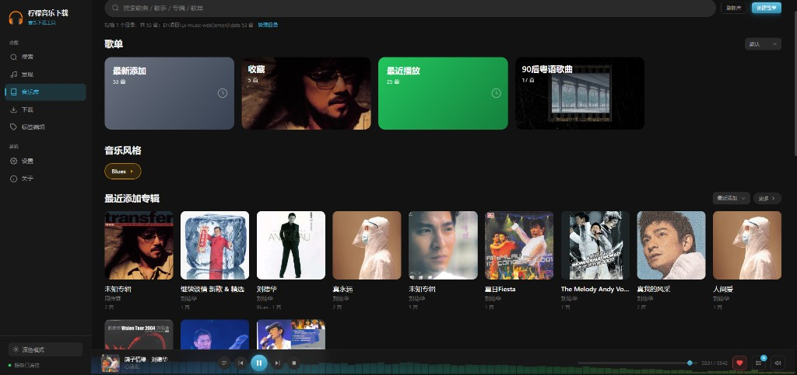
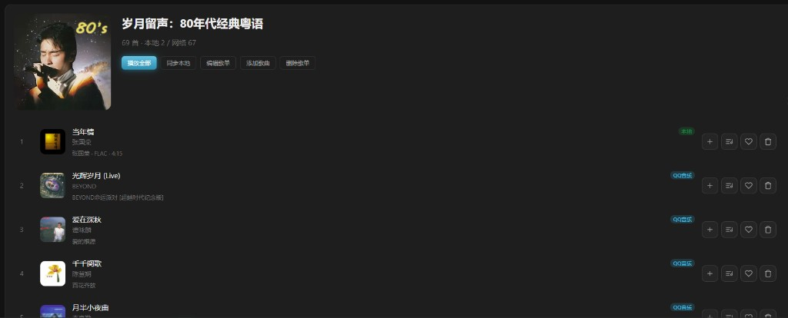
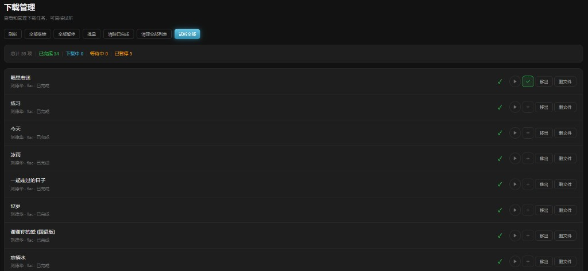
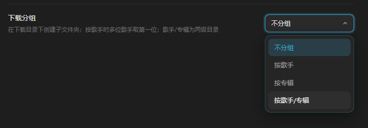
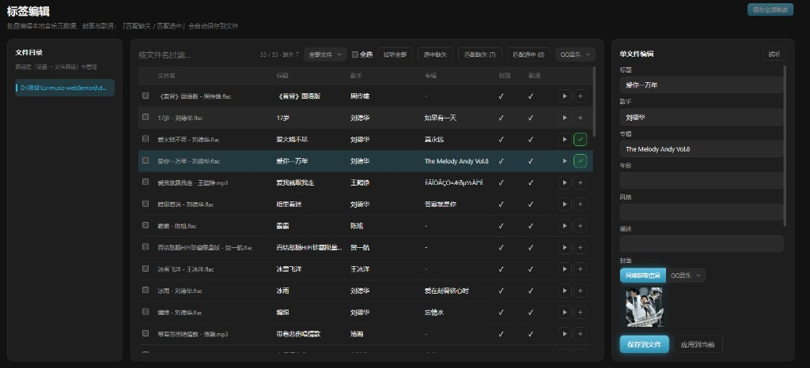

# 柠檬音乐下载 · Lemon Music

[](LICENSE)
[](https://github.com/jia070310/lemon-muisc/releases)

面向飞牛 NAS 与自托管环境的 **Web 音乐工具**：多平台搜索、歌单发现、在线试听、批量下载、本地标签管理。兼容落雪音乐（LX Music）自定义音源脚本，在浏览器中即可完成「找歌 → 试听 → 下载 → 整理」全流程。

当前版本：**v1.2.6** · 开源协议：**[MIT](LICENSE)**  
飞牛应用中心显示名：**柠檬音乐**（浏览器标题仍为「柠檬音乐下载」）  
仓库：[https://github.com/jia070310/lemon-muisc](https://github.com/jia070310/lemon-muisc)

飞牛 FPK 为**独立原生应用**，不再依赖 Docker。运行时使用应用中心 **Node.js v22**。

---

## 界面预览

### 音乐库 · 本地浏览（v1.2.5）

扫描本地音乐目录，浏览歌单、专辑、流派与歌曲；智能歌单「最新添加」「最近播放」「收藏」，支持创建自定义歌单。



### 复制网络歌单 · 本地/网络标识（v1.2.5）

创建歌单时可粘贴各平台歌单链接，完整导入到音乐库；支持「同步本地」扫描已下载歌曲，列表显示 **本地** / **网络**（平台名）标识。



### 下载管理 · 标签编辑（v1.2.5）

下载任务支持继续/暂停、批量操作、移出列表与删除文件；设置中可按歌手/专辑分组保存；标签编辑可批量匹配缺失元数据。

| 下载管理 | 下载分组 | 标签编辑 |
|----------|----------|----------|
|  |  |  |

### 搜索 · 试听 · 下载（桌面端）

多平台关键词检索，结果列表支持单曲试听、加入试听队列、按音质下载；底栏播放器常驻，频谱动效实时跳动。


### 全屏播放 · 频谱可视化 · 滚动歌词（桌面端）

点击封面进入全屏模式，蓝绿渐变频谱铺满底部，歌词实时滚动高亮，支持进度、音量、播放控制。


### 移动端自适应

手机访问自动切换紧凑布局：全屏播放竖屏沉浸式，歌词清晰大字显示；歌单操作收纳为「更多」菜单。

| 全屏播放 | 搜索页 |
|----------|--------|
|  |  |

> 请仅用于个人已合法授权的音乐资源管理。请遵守当地法律法规及各平台服务条款，不要将本项目用于侵权或商业用途。

---

## 功能概览

### 搜索

- 支持 **酷我、酷狗、QQ 音乐、网易云、咪咕** 等平台（通过激活的音源脚本检索）
- 按关键词分页搜索，展示歌名、歌手、专辑、时长与可用音质
- 单曲 **试听**、**加入试听列表**、**选择音质下载**
- 批量「播放全部」「全部加入列表」
- **可同时激活多个音源**
- **多选批量下载**：勾选后统一选音质入队；某首没有该音质时自动降到可用档位再加入队列

### 发现（歌单）

- 粘贴歌单链接或 ID，解析并展示歌单信息与完整歌曲列表
- **推荐歌单**：按平台切换，支持「最热 / 最新」排序
- 歌单内歌曲支持试听、加入队列、按音质下载

### 试听与播放

- 底栏 **播放器**：播放 / 暂停、上一首 / 下一首、进度条、音量精确调节
- **音频可视化**：播放栏背景蓝绿渐变频谱动效
- **全屏播放页**：大封面、实时滚动歌词、底部沉浸式频谱
- **桌面端 / 手机端** 自适应布局
- **试听列表**：持久化；列表循环、单曲循环、随机播放
- **后台播放**、深色 / 浅色主题

### 下载

- 下载任务队列，WebSocket 实时进度
- 搜索 / 发现页支持多选批量下载（无对应音质时自动降档）
- 保存路径、文件名格式、最大并发、同名文件处理（询问/跳过/覆盖）、按专辑分组
- 内嵌封面 / 歌词；独立 `.lrc`
- 失败可重试原音质或降质下载
- 中断任务可继续；支持「移出列表」（保留文件）与「删除文件」

### 音乐库

- 扫描「设置 → 文件路径」中的**音乐库目录**，浏览本地歌曲与专辑
- 智能歌单：**最新添加**、**最近播放**、**收藏**；支持创建自定义歌单
- **复制网络歌单**：创建歌单时粘贴平台链接，完整导入 QQ 音乐 / 网易云 / 酷狗等平台歌单
- **同步本地**：自动匹配音乐库中已下载歌曲；列表显示 **本地** / **网络**（平台名）标识
- 歌单封面：最新添加 / 最近播放为渐变卡片，其余使用歌曲封面（可自定义上传）
- 专辑行展示封面与标签；歌曲网格分页，显示专辑 / 年份 / 流派 / 格式
- 本地试听、收藏、加入试听列表；搜索 / 发现页可挑选歌曲加入歌单
- 内嵌封面通过 `/api/tag/cover` 按需加载；支持点击「刷新库」重新扫描

### 标签编辑

- 扫描本地音乐目录，批量编辑 ID3 / FLAC 标签
- 按文件名自动匹配网络元数据
- 本地文件试听、加入试听列表

### 设置

| 模块 | 内容 |
|------|------|
| **文件路径** | 音乐库目录（可多路径）与下载保存目录（独立单路径） |
| **音源管理** | 导入脚本，可同时激活多个音源 |
| **风格样式** | 主题、配色、封面样式、音频可视化、音乐库歌曲列数 |
| **下载设置** | 路径、文件名、并发、分组、同名文件处理（询问/跳过/覆盖） |
| **账号 / 邮件** | 多用户管理（管理员）、SMTP 邮箱验证与找回密码 |
| **内嵌数据 / 歌词文件** | 封面与歌词写入音频或 `.lrc` |

### 飞牛 NAS

- **原生 FPK**，不依赖 Docker，端口默认 **7983**
- 依赖应用中心 **Node.js v22**
- 安装向导填写绝对路径即可使用
- 卸载可保留或删除应用配置，不删除用户音乐文件

---

## 技术栈

| 部分 | 说明 |
|------|------|
| 前端 | Vue 3 + Vue Router + Vite |
| 后端 | Node.js 20+、Express 5、WebSocket |
| 数据 | better-sqlite3 |
| 标签 | node-id3、music-metadata |
| 可视化 | Web Audio API + Canvas |
| 飞牛部署 | 原生 FPK + 商店 Node.js v22 |

---

## 快速开始（本地开发）

需要 [Node.js](https://nodejs.org/) 20 或以上。

```bash
git clone https://github.com/jia070310/lemon-muisc.git
cd lemon-muisc
npm install
npm run dev
```

| 地址 | 作用 |
|------|------|
| http://localhost:5174 | Vite 开发前端 |
| http://localhost:7983 | Express 后端 |

生产模式：

```bash
npm run build
npm start
```

### 首次使用

1. **首次打开**：创建管理员账号（可选配置 SMTP 邮件服务）
2. **设置 → 音源管理**：导入落雪兼容音源并激活（可同时激活多个）
3. **设置 → 文件路径**：添加音乐库目录与下载保存目录
4. **搜索** 或 **发现** 找歌试听、下载；**音乐库** 浏览本地收藏，或通过「复制网络歌单」导入平台歌单；**标签编辑** 整理本地文件

---

## 账号与恢复

用户账号保存在配置目录下的 SQLite 数据库中：

| 项目 | 路径 |
|------|------|
| 本地开发（默认） | `config/lx-music.db` |
| 飞牛 NAS（示例） | `/vol1/@appconf/lemon-music/config/lx-music.db` |

相关表：`users`（账号）、`sessions`（登录会话）、`auth_tokens`（邮件令牌）、`user_settings`（个人歌单/收藏）。

### 首次初始化

创建管理员后，可选择两种忘记密码的恢复方式：

| 方式 | 说明 |
|------|------|
| **邮件找回** | 配置 SMTP，支持邮箱验证与登录页「忘记密码」 |
| **本地保存账号** | 在配置目录生成 `ADMIN_CREDENTIALS.txt`（含明文密码），无需配置邮箱 |

同时会生成 `SETUP_README.txt`（不含密码）记录初始化信息。

### 忘记密码

```bash
# 列出用户
npm run auth:reset-password -- --list

# 重置指定用户密码（保留账号）
CONFIG_PATH=/你的配置目录 npm run auth:reset-password -- admin 新密码
```

若已配置 SMTP 且邮箱已验证，也可在登录页使用「忘记密码」。若初始化时选择了「本地保存账号」，可查看配置目录下的 `ADMIN_CREDENTIALS.txt`。

### 清空所有用户（重新初始化）

删除全部账号后会再次进入「初始化管理员」向导。**不会**删除音源、路径、下载任务等全局数据。

```bash
# 先查看当前用户
npm run auth:reset-users -- --list

# 确认清空（必须带 --yes）
npm run auth:reset-users -- --yes

# 飞牛 NAS 示例
CONFIG_PATH=/vol1/@appconf/lemon-music/config npm run auth:reset-users -- --yes
```

执行后请刷新浏览器；若仍自动登录，清除本站 `localStorage`（键名 `lemon-auth-token`）。

初始化完成后，配置目录会生成 `SETUP_README.txt` 说明文件（不含密码）。

---

## 飞牛 NAS（FPK）

```powershell
npm run fpk:build
```

生成 `fpk/lemon-music-1.2.5-x86.fpk` 与 `fpk/lemon-music-1.2.5-arm.fpk`。说明见 [docs/fpk-install.md](docs/fpk-install.md)。

---

## 常用脚本

| 命令 | 说明 |
|------|------|
| `npm run dev` | 同时启动前后端开发服务 |
| `npm run build` | 构建前端到 `dist/public` |
| `npm run start` | 启动后端 |
| `npm run auth:reset-password -- --list` | 列出所有用户 |
| `npm run auth:reset-password -- <用户> <新密码>` | 重置用户密码 |
| `npm run auth:reset-users -- --list` | 查看用户（清空前预览） |
| `npm run auth:reset-users -- --yes` | 清空所有用户并重新初始化 |
| `npm run fpk:build` | 打包原生 FPK |

---

## 版本与更新

- 当前版本见仓库 [Releases](https://github.com/jia070310/lemon-muisc/releases)
- 变更说明：[docs/RELEASE-NOTES.md](docs/RELEASE-NOTES.md)
- 应用内 **关于** 页会检测 GitHub 最新 Release

---

## 致谢与声明

音源脚本需自行准备，本仓库不内置任何第三方平台音源。项目定位为 NAS 上的个人音乐整理工具，与落雪音乐桌面版无官方从属关系。

本应用仅供个人合法使用。请确保你对所管理的音乐拥有相应权利，并遵守当地法律与各平台条款。

## License

本项目采用 [MIT License](LICENSE)。

请仅用于管理你个人已合法授权的音乐资源，并遵守当地法律法规及各音乐平台服务条款。
